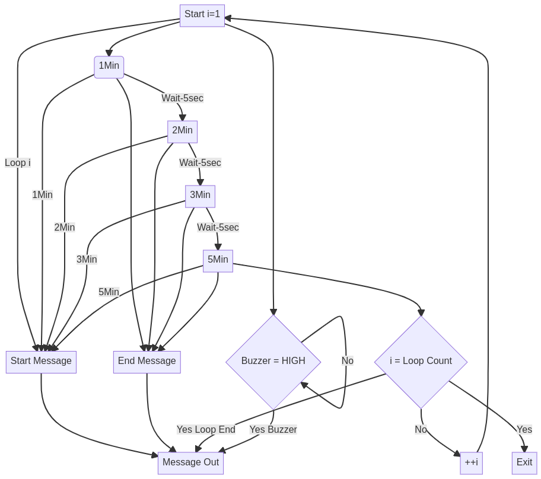

# sailing regatta timer - automated test framework
<!-- TOC depthFrom:1 depthTo:6 withLinks:1 updateOnSave:1 orderedList:0 -->

- [sailing regatta timer - automated test framework](#sailing-regatta-timer-automated-test-framework)
	- [Key Features](#key-features)
	- [Flow Diagram](#flow-diagram)
	- [Board and Wiring](#board-and-wiring)

<!-- /TOC -->
## Key Features
+ automated routine that exercises sailing regatta timer while monitoring buzzer activation and validates;
  + buzzer is only activated during timer sequence
  + buzzer activation occurs at the correct time during timer sequence
+ test board connected to computer that monitors serial port

## Flow Diagram

## Board and Wiring
Board and wiring duplicates [github regatta timer](https://github.com/amesclar/regattaTimer-Kicad). 
