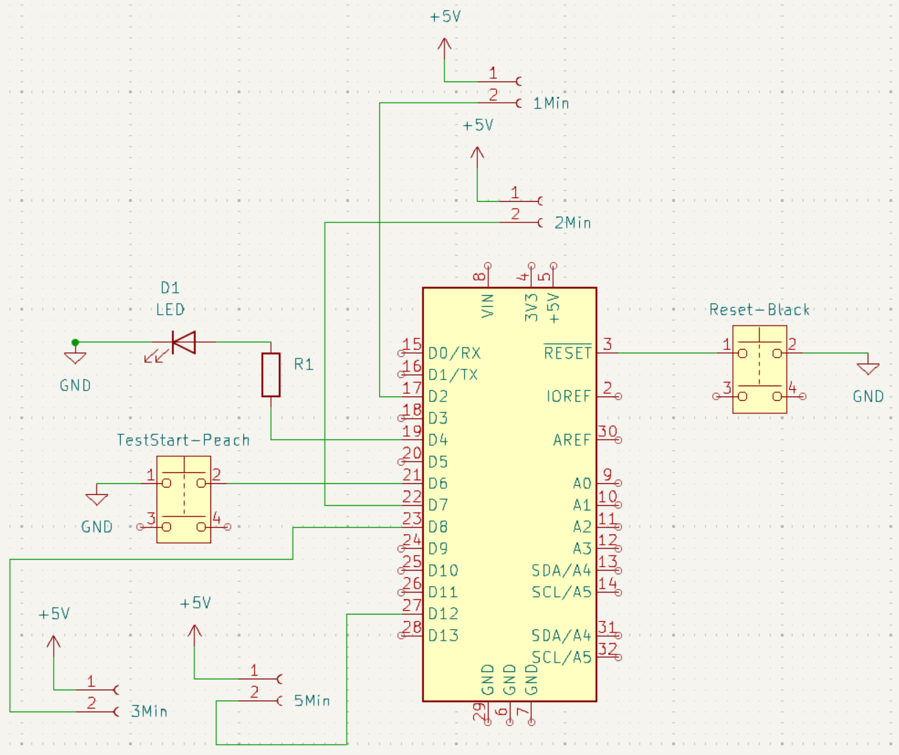
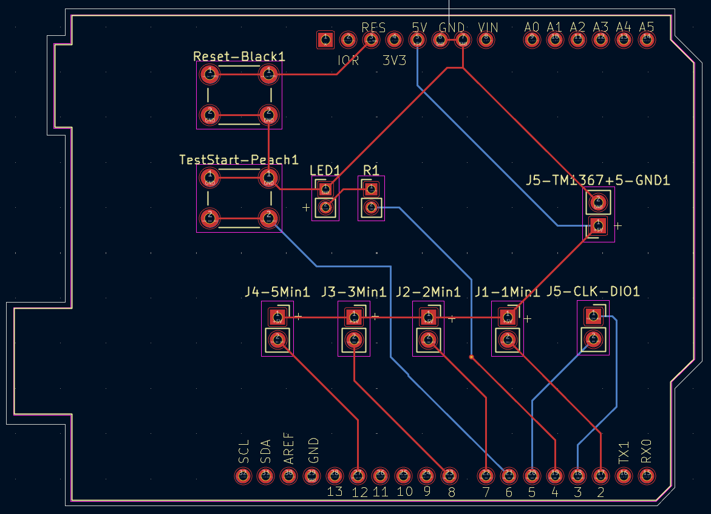

# Sailing Regatta Timer - Automated Test Framework

- [Sailing Regatta Timer - Automated Test Framework](#sailing-regatta-timer---automated-test-framework)
  - [Key Features](#key-features)
  - [Measuring 12v](#measuring-12v)
  - [Flow Diagram](#flow-diagram)
  - [Board and Wiring](#board-and-wiring)
    - [Schematic](#schematic)
    - [PCB](#pcb)

## Key Features

- automated routine that exercises sailing regatta timer while monitoring buzzer activation (horn voltage)
- test board connected to computer that monitors serial port
- measures and logs horn voltage

## Measuring 12v

```text
V_out = V_in × (R2 / (R1 + R2))

R1 = 10kΩ
R2 = 5k1
```

Ratio: 2:1 (divides voltage by 3)
Output at 12V input: 4V

## Flow Diagram


## Board and Wiring

### Schematic



### PCB


