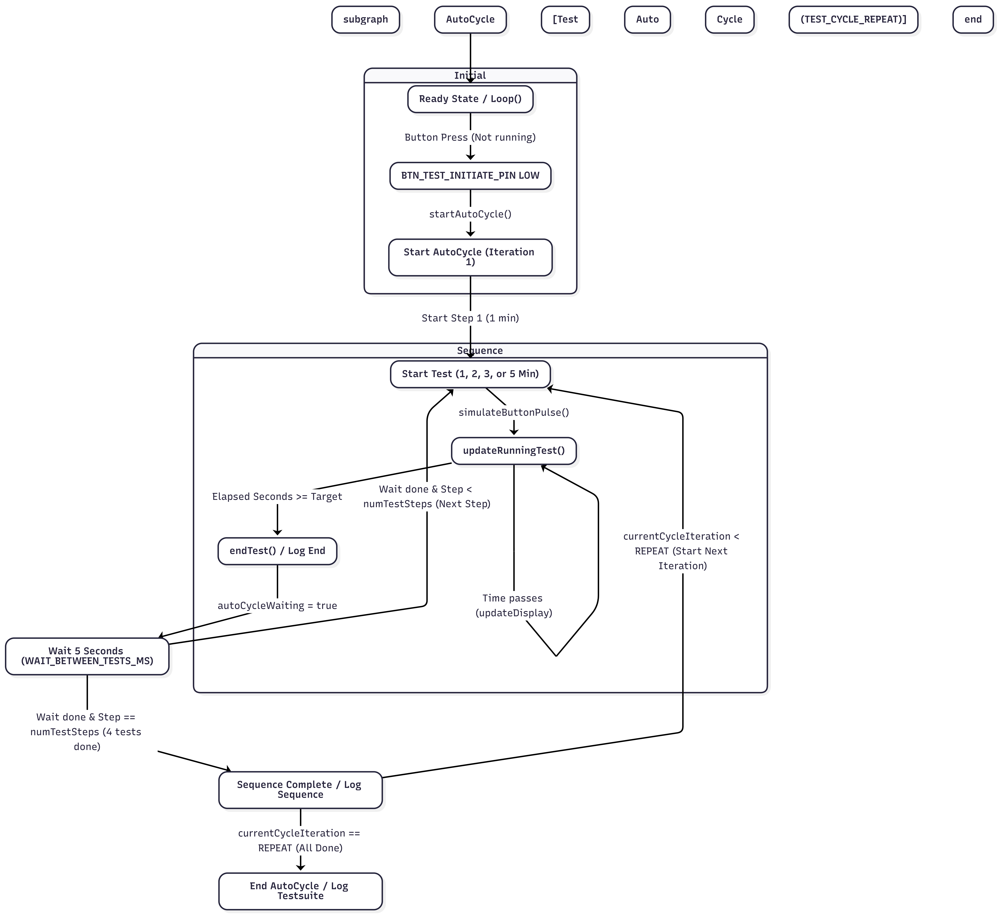

*sailing regatta timer - automated test framework*
# Key Features
+ automated routine that exercises sailing regatta timer while monitoring buzzer activation and validates;
  + buzzer is only activated during timer sequence
  + buzzer activation occurs at the correct time during timer sequence
+ test board connected to computer that monitors serial port
+ measures and logs horn voltage

# measuring 12v
V_out = V_in × (R2 / (R1 + R2))
R1 = 10kΩ
R2 = 5kΩ
Ratio: 2:1 (divides voltage by 3)
Output at 12V input: 4V ✓ SAFE

# Flow Diagram

# Board and Wiring
Board and wiring duplicates [github regatta timer](https://github.com/amesclar/regattaTimer-Kicad).
